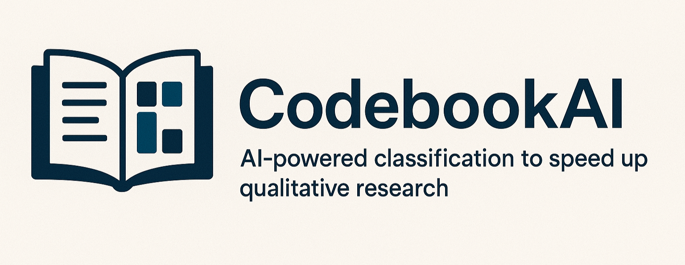

CodebookAI is a tool designed to assist qualitative researchers in processing large datasets through OpenAI's GPT models (e.g., 4o, 5, o3, etc.). It enables batch processing of text snippets against a set of labels, significantly reducing the cost and time associated with manual coding, as well as a variety of other tools aimed at qualitative data preparation and analysis. 

## Getting Started

- Download the latest .exe ([Get one here](https://github.com/tmaier-kettering/CodebookAI/releases)). This is a standalone application that does not require installation. Just double-click to run. Only tested on Windows 10.
- CodebookAI required you to supply an OpenAI API key in the Settings (File > Settings) ([Get one here](https://platform.openai.com/api-keys)). This keeps CodebookAI open-source and free to use. You control your own API key and are responsible for any costs incurred through your usage of OpenAI's services.
- Not sure what CodebookAI can do? Check out the [Example](wiki/Example/Example.md) section.

## Help & Documentation

- [File](./wiki/File/File.md)
- [Data Prep](./wiki/DataPrep/DataPrep.md)
- [LLM Tools](./wiki/LLMTools/LLMTools.md)
- [Data Analysis](./wiki/DataAnalysis/DataAnalysis.md)
- [Help](./wiki/Help/Help.md)
- [Example](wiki/Example/Example.md)

---

## Developer Guide

### Running Tests

The repository includes an automated test suite that runs without a live
OpenAI API key or a graphical display.

```bash
# Install dependencies
pip install -r requirements.txt
pip install -r requirements-dev.txt

# Run all tests
pytest
```

Continuous integration is configured via GitHub Actions (`.github/workflows/tests.yml`)
and runs on every push and pull request across Python 3.10, 3.11, and 3.12.

See [CONTRIBUTING.md](CONTRIBUTING.md) for a full guide on setting up a local
development environment, the project structure, coding conventions, and how to
submit changes.

---

## How to Support

[](https://buymeacoffee.com/professthor)

If you find this tool helpful, consider supporting its development by [buying me a coffee](https://buymeacoffee.com/professthor)! 

## License

This project is provided as-is for educational and research purposes. Please ensure compliance with OpenAI's usage policies when using this application.

## Disclaimer 
This application requires an OpenAI API key and will incur costs based on your usage. Batch processing typically offers significant cost savings compared to individual API calls. Please monitor your usage and costs through the OpenAI dashboard.

Additionally, not all GPT models have been tested and may not work with this software. At this time, the models that have been tested are gpt-4o, gpt-4o-mini, and gpt-5.

---
