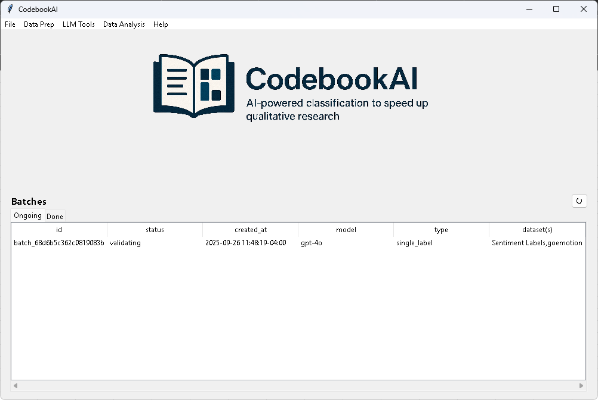

# Example

This page provides a comprehensive example of how CodebookAI might be used for qualitative data analysis.
This example is designed to go through most of the major features of the application, including data preparation, using LLM tools for coding, and analyzing the results.

## Example Scenario

A researcher would like to classify a subset of the [GoEmotions](https://research.google/blog/goemotions-a-dataset-for-fine-grained-emotion-classification/)
dataset using positive, negative, and neutral sentiment labels using gpt-4o. However, they'd like to validate that the model is performing well before coding the entire dataset.
Thus, they'd like to first code a sample of 100 responses and validate the model's performance on a [pre-existing set of human-coded sentiment labels](https://www.kaggle.com/datasets/sbhatti/financial-sentiment-analysis).

## Step 0: Install CodebookAI and Configure the OpenAI API Key and Model

Download the .exe from the releases page. Upon opening the application, navigate to File > Settings and enter your OpenAI API key ([get one here](https://platform.openai.com/api-keys)). Select gpt-4o as the model to use for the LLM tools.

## Step 1: Prepare the Data

There are three CSVs to prepare:
1. [goemotions.csv](./goemotions.csv) - the subset of the GoEmotions dataset the researcher would like to code.

| text                                                                                                                                               | id      | emotion   |
|:---------------------------------------------------------------------------------------------------------------------------------------------------|:--------|:----------|
| Which means his lifestyle is unsustainable. Look at the house and the cars. Even renting he’s just racking up debt pretending to be a millionaire. | edl8z8e | neutral   |
| Maybe concerned about you being underweight? She is probably concerned you don’t eat enough and is trying to help you                              | efaj94g | confusion |
| [NAME] can hug them too.                                                                                                                           | edu0a05 | curiosity |
| The way him and his mom talk to each other is like a little boy and his Mommy!                                                                     | ef0wcpk | amusement |
| Well if you refer back to my original reply to you that should be clear, really.                                                                   | efgsq0t | neutral   |
| …                                                                                                                                                  | …       | …         |

2. [sentiment_labels.csv](./sentiment_labels.csv) - the human-coded sentiment labels

|          |
|:---------|
| positive |
| negative |
| neutral  |

3. [financial_sentiment.csv](./financial_sentiment.csv) - the full financial sentiment dataset

| text                                                                                                                                                                                              |   id | emotion   |
|:--------------------------------------------------------------------------------------------------------------------------------------------------------------------------------------------------|-----:|:----------|
| For the last quarter of 2010 , Componenta 's net sales doubled to EUR131m from EUR76m for the same period a year earlier , while it moved to a zero pre-tax profit from a pre-tax loss of EUR7m . |    1 | positive  |
| According to the Finnish-Russian Chamber of Commerce , all the major construction companies of Finland are operating in Russia .                                                                  |    2 | neutral   |
| SSH COMMUNICATIONS SECURITY CORP STOCK EXCHANGE RELEASE OCTOBER 14 , 2008 AT 2:45 PM The Company updates its full year outlook and estimates its results to remain at loss for the full year .    |    3 | negative  |
| Kone 's net sales rose by some 14 % year-on-year in the first nine months of 2008 .                                                                                                               |    4 | positive  |
| SAP Q1 disappoints as #software licenses down. Real problem? #Cloud growth trails                                                                                                                 |    5 | negative  |
| …                                                                                                                                                                                                 | …    | …         |

## Step 2: Create a Sample of the Financial Sentiment Dataset

The researcher would like to create a random sample of 100 responses from the financial sentiment dataset to validate the model's performance. 
They can use the "[Sampler](../DataPrep/Sampler.md)" tool in the "[Data Prep](../DataPrep/DataPrep.md)" section of CodebookAI.

This creates a new CSV file called [financial_sentiment_sample.csv](financial_sentiment_sample.csv) with 100 randomly selected rows from the original financial_sentiment.csv file.

## Step 3: Run a Live Single Label Text Classification

The researcher can now use the "[Single Label Text Classification](../LLMTools/LiveMethods/SingleLabelClassification.md)" tool in the "[LLM Tools](../LLMTools/LLMTools.md) > Live" section of CodebookAI to classify the sample dataset using the positive, negative, and neutral sentiment labels.
A live tool is appropriate here because the dataset is small (100 rows) and the researcher would like to see the results immediately.

First, the researcher is prompted to select the labels data, so they select sentiment_labels.csv. Since this data doesn't have a header row, they uncheck the "File has headers" box.
The Dataset Name is not used for this tool, so they leave it as the default.
Finally, they click "Import".

Next, they select the text data, so they select financial_sentiment_sample.csv.
They can leave all the defaults since the text column is already selected since it is the first column and has headers.
Finally, they click "Import".

This progress bar will appear while the tool is processing the data.

The researcher saves the results as [financial_sentiment_sample_coded.csv](financial_sentiment_sample_coded.csv).

| id | quote                                                                                    | label    |
|----|------------------------------------------------------------------------------------------|----------|
| 1  | Finnish fibers and plastic products maker Suominen Yhtymä Oyj said it has signed a deal. | positive |
| 2  | Net profit in the same period in 2006 was ( x ) million euros.                           | neutral  |
| 3  | Dealers said the share was largely hit by investor speculation.                          | negative |
| 4  | Target company : Tieto Corporation , Business area : IT services.                        | neutral  |
| 5  | The total capacity of the factory will be approx. 150,000 tons per year.                 | neutral  |
| …  | …                                                                                        | …        |

## Step 4: Evaluate the Model's Performance

The researcher can now evaluate the model's performance by comparing the model-coded labels to the human-coded labels in the original financial_sentiment.csv file.
This can be done using the "[Reliability Statistics](../DataAnalysis/ReliabilityStatistics.md)" tool in the "[Data Analysis](../DataAnalysis/DataAnalysis.md)" section of CodebookAI.
This tool requires two datasets: the model-coded data and the human-coded data.
For each dataset, you must indicate the text and label columns. The text columns in each dataset is used to match the rows between the two datasets.
Only rows that exist in both datasets will be used for the reliability statistics.

The first dataset the researcher imports is the model-coded data, so they select financial_sentiment_sample_coded.csv.
The text column is labels 'quote' and the label column is labeled 'label'.
They use the Other option for the Dataset Name and enter "Model Coded Data".'
Finally, they click "Next".

The second dataset the researcher imports is the human-coded data, so they select financial_sentiment_sample.csv.
Alternatively they could have selected the full financial_sentiment.csv. Since the tool only uses rows that exist in both datasets, it would have automatically filtered the full dataset to only the 100 rows that exist in the sample dataset.
The text column is labeled 'text' and the label column is labeled 'emotion'.
They use the Other option for the Dataset Name and enter "Human Coded Data".'
Finally, they click "Ok".

They save the results as [agreement_Model Coded Data_vs_Human Coded Data.xlsx](agreement_Model%20Coded%20Data_vs_Human%20Coded%20Data.xlsx).
The results show a percent agreement of 76.5% and a Cohen's Kappa of 0.63, indicating moderate agreement between the model-coded and human-coded labels.

## Step 5: Run a Batch Single Label Text Classification

Let's assume the researcher is satisfied with the model's performance and would like to code the entire GoEmotions subset now.

The researcher can now use the "[Single Label Text Classification](../LLMTools/BatchMethods/SingleLabelClassification.md)" tool in the "[LLM Tools](../LLMTools/LLMTools.md) > Batch" section of CodebookAI to classify the GoEmotions subset using the positive, negative, and neutral sentiment labels.

A batch tool is appropriate here because the dataset is large (over 2000 rows) and the researcher does not need to see the results immediately.

First, the researcher is prompted to select the labels data, so they select sentiment_labels.csv. Since this data doesn't have a header row, they uncheck the "File has headers" box.
This time, the dataset name is important because it will appear in the Batches table on the main window, so they enter "Sentiment Labels" using the Other option.
Finally, they click "Import".

Next, they need to select the text data, so they select goemotions.csv.
The data does have headers, so they leave the "File has headers" box checked.
The text data is already in the first column, so they leave the default selection.
The file name is an appropriate name so they use the "Use file name" option.
Finally, they click "Import".

They can now track the progress on the Batches table on the main window. The refresh button in the top-right corner can be used to refresh the status of all batches.
The Batches table does NOT refresh automatically. However, it will refresh automatically when you restart the application or create a new batch.

Once the batch is complete, the status will change to "Completed" and the researcher can right-click the row and select "Download" to download the results.

They save the results as [goemotions_coded.csv](goemotions_coded.csv).

| quote                                                              | label    |
|--------------------------------------------------------------------|----------|
| Which means his lifestyle is unsustainable. Look at his stomach.   | negative |
| Maybe concerned about you being underweight? Sounds like he cares. | positive |
| [NAME] can hug them too.                                           | positive |
| The way him and his mom talk to each other is great.               | positive |
| Well if you refer back to my original reply to you...              | neutral  |
| ...                                                                | ...      |

---